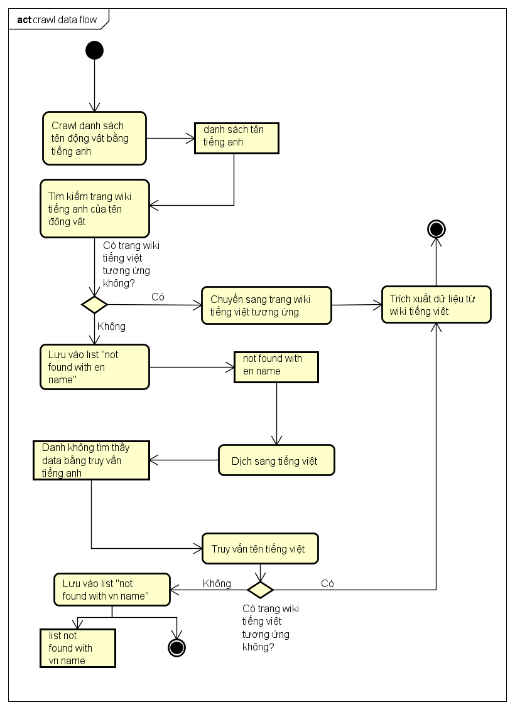

# 🐾 Animal Search Engine

**Animal Search Engine** is a powerful search engine leveraging **Elasticsearch** to provide detailed information about **animals**. The system also supports scalability to search across various fields through flexible configurations via the Admin Dashboard.


---

## 🚀 Key Features

### 🔎 **Search Interface**
- **Simple Search Bar**: Enter queries to find detailed information about animals.
- **Visual Results**: Display accurate and appealing animal information powered by Elasticsearch.


### 🛠️ **Admin Dashboard**
- **Manage Elasticsearch Configurations**: Configure indices, filters, and search settings.
- **Expand Search Topics**: Customize to support various topics beyond animals.


### 🐾 **Data Crawling Module**
- **Animal Data Crawling**: Includes a dedicated module to crawl animal-related information from external sources.
- **Data Preparation for Elasticsearch**: Automatically structures and prepares data for indexing in Elasticsearch.
- This diagram below describes detail crawling data flow:

---

## 🏗️ System Architecture
This diagram below describes system architecture:


1. **Frontend**: User interfaces built with HTML, CSS and jQuery.
2. **Backend**: Powered by Flask (Python) to handle requests and connect to Elasticsearch.
3. **Elasticsearch**: A robust search engine for storing and managing search data.
4. **Data Crawling Module**: A Python-based module for collecting and processing animal-related data.

---

## 📦 Installation and Setup

### System Requirements
- Python >= 3.8
- Elasticsearch >= 8.0

### Installation
```bash
# Clone repository
git clone https://github.com/your-repo/animal-search-engine.git
cd animal-search-engine/app-demo

# Create a virtual environment
python -m venv .venv
source .venv/bin/activate  # On Windows use `.venv\Scripts\activate`

# Install Python dependencies
pip install -r requirements.txt
```

### Run the Application
```bash
# Start Elasticsearch (ensure Elasticsearch is configured)

# Run application
python run.py

# Access the application through your browser
http://127.0.0.1:5000
```

## ⚙️ Elasticsearch Configuration

- **Create Indices**: Use the Admin Dashboard to create new indices or modify existing ones.
- **Data Mapping**: Ensure data is optimized for search through mapping settings.

---

## 📖 Usage Guide

### Search Users
1. Access the search interface.
2. Enter keywords related to animals in the search bar.
3. Click **Search** to view results.

### Administrators
1. Log in to the Admin Dashboard.
2. Manage index configurations or expand search topics.
3. Save changes and test results.

### Data Crawlers
1. Run the data crawling module to fetch and prepare data.
2. Check logs for successful data indexing.
3. Use the Admin Dashboard to validate the indexed data.

---

## 🌟 Highlights
- **User-Friendly**: Provides an intuitive and easy-to-use interface.
- **Highly Scalable**: Supports searching across various domains.
- **Exceptional Performance**: Utilizes Elasticsearch for fast and accurate searches.
- **Automated Data Handling**: Streamlines data crawling and indexing processes.

---

> "Animal Search Engine is not just a tool for animal searches but a platform to explore the world!" 🌍